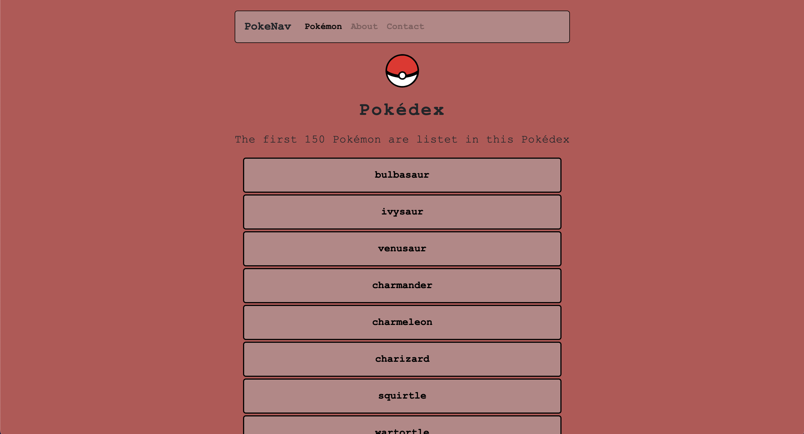
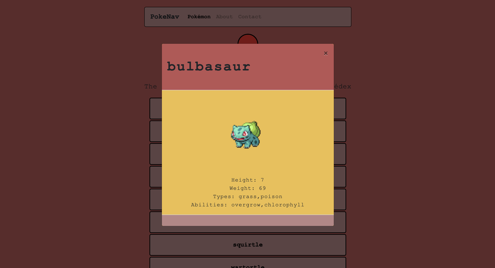
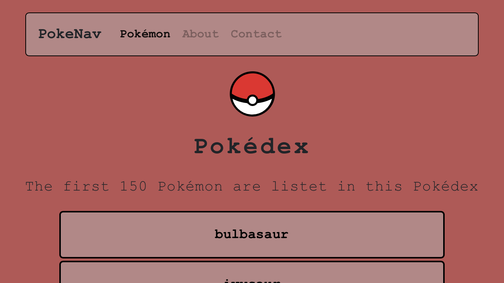

# Christians simple-js-app Pokedex

This is my Pokedex-App I created as a fellow for CareerFoundry.
It'll show all the pokemon with its name, height and type.

## Tech Tools:
- HTML5
- CSS3
- JS

## Screenshots:
### Desktop-Version

### Mobil-Version

## Link:
https://borkkris.github.io/simple-js-app/
