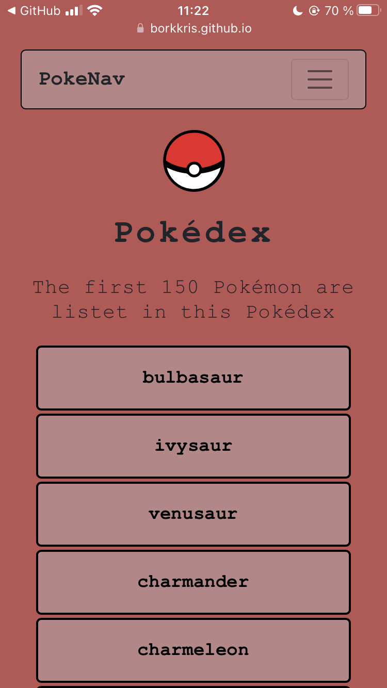

# Christians simple-js-app Pokedex

This is my Pokedex-App I created as a fellow for CareerFoundry.
It'll show all the pokemon with its name, height and type.

##Tech Tools:
- HTML5
- CSS3
- JS

##Screenshot:
Desktop-Version

Mobil-Version

##Link:
https://borkkris.github.io/simple-js-app/
