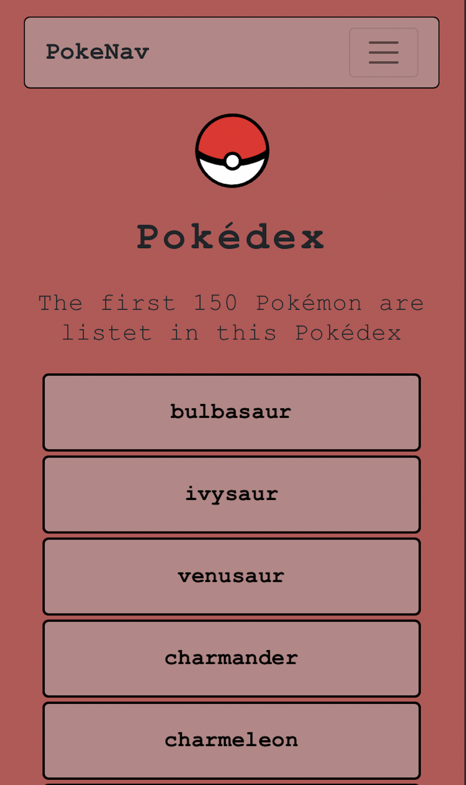
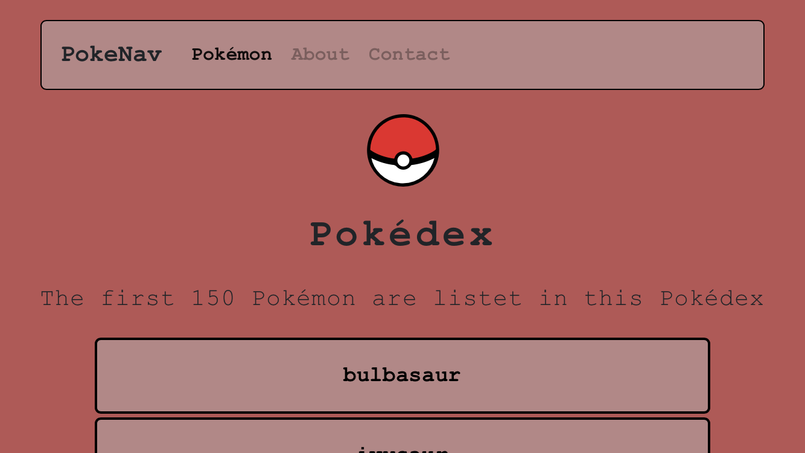
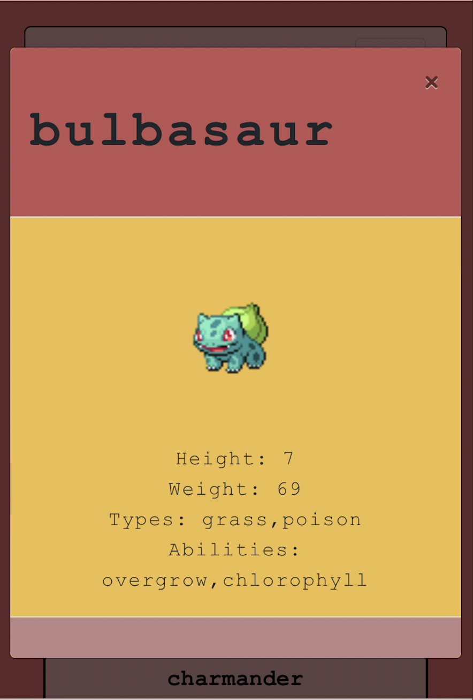

# Pokédex - App

This is my Pokedex-App I created as a fellow for CareerFoundry.
It'll show the first 150 the pokemon with its name, height, type and abilities.

## Tech Tools:
- HTML5
- CSS3
- JS

## Screenshots:
### Desktop-Version

### Mobile-Version

## Link:
https://borkkris.github.io/simple-js-app/
